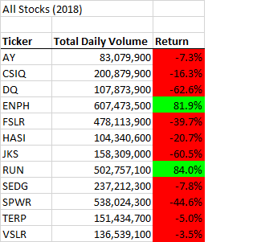

# Stock-Analysis

## Overview of Project
The purpose of this stock analysis is to help the client analyze an entire dataset that would be easy and more user-friendly. In the analysis, for each target green energy stock the “Total Daily Volume” and “Yearly Return” was collected and formatted to help the client make informed financial decisions. While “DQ” was of interest, the client will see how all stocks performed. Further, this analysis includes a VBA code to input the year of choice to run the analysis and will determine how long the code takes to execute and compile the results.

## VBA Analysis Results

#### Compared Stock Performance between 2017 and 2018  
In 2018, “DQ” underperformed at -62.6% along with nine with green energy stocks. Only “ENPH” and “RUN” had positive Returns.  

###### *Refactored VBA “All Stock Analysis” (2018) 

In 2017, “DQ” had a positive return at 199.4%, the highest Yearly Return of all stocks. ENPH and RUN shows positive return and high daily volume count in 2017 and 2018.  

###### *Refactored VBA “All Stock Analysis” (2017)

#### Compared VBA Stock Performance Execution Times 

The refactor code outputs ran faster than the original VBA code as captured in the timer message box below. The first time you run a macro, the elapsed time may be longer than subsequent runs because computer resources need to be allocated to run the macro. Once allocated, these resources are ready for subsequent runs. 

#### Original VBA Code Run  

  

#### Refactored VBA Code Run

  

#### Refactored VBA Script

The “Compared Stock Performance between 2017 and 2018” was refactor in VBA using four loops: 

(1) Create a tickerIndex variable and set it equal to zero before iterating over all the rows. You will use this tickerIndex to access the correct index across the four different arrays you’ll be using: the tickers array and the three output arrays you’ll create in Step 1.

(2) Create a for loop to initialize the tickerVolumes to zero. Then, create a for loop that will loop over all the rows in the spreadsheet.

(3) Inside the for loop in Step 2, write a script that increases the current tickerVolumes (stock ticker volume) variable and adds the ticker volume for the current stock ticker. Use the tickerIndex variable as the index to assign the current closing price. 

(4) Use a for loop to loop through your arrays (tickers, tickerVolumes, tickerStartingPrices, and tickerEndingPrices) to output the “Ticker,” “Total Daily Volume,” and “Return” columns in your spreadsheet.

#### Refactored VBA Script Design 

Format the output sheet on the "All Stocks Analysis" worksheet.
     Dim startTime As Single
     Dim endTime  As Single

       yearValue = InputBox("What year would you like to run the analysis on?")
       'Start timer after year is entered
        startTime = Timer 

Format the output sheet on All Stocks Analysis worksheet
       Worksheets("All Stocks Analysis").Activate
       Range("A1").Value = "All Stocks (" + yearValue + ")
           
Initialize an array of all tickers.

Prepare for the analysis of tickers.
a.	Activate the (yearValue) worksheet.
b.	Get the number of rows to loop over

1. Create a ticker Index, three output arrays and a for loop to initialize the tickerVolumes to zero.
       tickerIndex = 0

Create three output arrays
       Dim tickerVolumes(12) As Long
       Dim tickerStartingPrices(12) As Single
       Dim tickerEndingPrices(12) As Single

2. Create a loop to initialize the tickerVolumes to zero and loop over all the rows in the spreadsheet.
         For i = 0 To 11
       	 TickerVolumes (i) = 0

        Next i
        
    	    Worksheets(yearValue).Activate
   	      For i = 2 To RowCount

3. Increase volume for current ticker. Check if the current row is the first row with the selected tickerIndex and check if the current row is the last row with the selected ticker. If the next row’s ticker doesn’t match, increase the tickerIndex    

          tickerVolumes(tickerIndex) = tickerVolumes(tickerIndex) + Cells(i, 8).Value
             If Cells(i, 1).Value = tickers(tickerIndex) And Cells(i - 1, 1).Value <> tickers(tickerIndex) Then
              tickerStartingPrices(tickerIndex) = Cells (i, 6).Value      
       End If
             If Cells(i, 1).Value = tickers(tickerIndex) And Cells(i + 1, 1).Value <> tickers(tickerIndex) Then
        	    tickerEndingPrices(tickerIndex) = Cells(i, 6).Value
       End If           
        	   If Cells(i + 1, 1).Value <> Cells(i, 1).Value Then
        	    tickerIndex = tickerIndex + 1          
       End If
       
       Next i

4. Loop through arrays to output the Ticker, Total Daily Volume, and Return.
          For i = 0 To 11
            Worksheets("All Stocks Analysis").Activate
       	    Cells(4 + i, 1).Value = tickers(i)
     	      Cells(4 + i, 2).Value = tickerVolumes(i)
        	  Cells (4 + i, 3).Value = tickerEndingPrices(i) / tickerStartingPrices(i) - 1
            
       Next i

       Formatting
       Worksheets("All Stocks Analysis").Activate
       Range("A3:C3").Font.FontStyle = "Bold"
       Range("A3:C3").Borders(xlEdgeBottom).LineStyle = xlContinuous
       Range("B4:B15").NumberFormat = "#,##0"
       Range("C4:C15").NumberFormat = "0.0%"
       Columns("B").AutoFit
    
       Color conditional formatting
       dataRowStart = 4
       dataRowEnd = 15

       For j = dataRowStart To dataRowEnd
       If Cells(j, 3) > 0 Then
          Cells(j, 3).Interior.Color = vbGreen
       Else
          Cells(j, 3).Interior.Color = vbRed 
       End If
        
       Next j (end timer and add message box to display “second for the year”) 
       endTime = Timer
    	MsgBox "This code ran in " & (endTime - startTime) & " seconds for the year " & (yearValue)

       End Sub    

## Summary

At the click of a button, the client can analyze an entire dataset and expand the dataset to include the entire stock market over the last few years. Although the original code works well for a dozen stocks, it might not work as well for thousands of stocks. And if it does, it may take a long time to execute. The refactored VBA script will loop through all the data one time in order to collect the same information in less time. 
